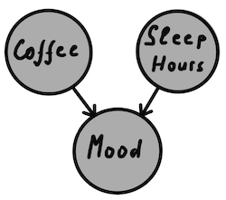

# Bayesnet

This gem provides an DSL for constructing Bayesian networks and let to execute basic inference queries. It is also capable of parsing .BIF format ([The Interchange Format for Bayesian Networks](https://www.cs.washington.edu/dm/vfml/appendixes/bif.htm)).


### Example:

Someone has decided to study how some sleep hours followed by a cup of coffee are affecting a morning mood. 
Here is the graphical model:



`Sleep hours` could have values `:six, :seven, :eight`. `Mood` could be `:bad, :moderate, :good` and variable 
`Coffee` could take values `:yes, :no`. Here is how accumulated statistics could be compiled in a Bayesian network and then defined in the code:

```
net = Bayesnet.define do
      node :coffee do
        values yes: 0.7, no: 0.3
      end

      node :sleep_hours do
        values six: 0.1, seven: 0.3, eight: 0.6
      end

      node :mood, parents: [:coffee, :sleep_hours] do
        values [:good, :moderate, :bad] do
          distributions do
            as [0.8, 0.1, 0.1], given: [:yes, :eight]
            as [0.6, 0.2, 0.2], given: [:yes, :seven]
            as [0.4, 0.4, 0.2], given: [:yes, :six]
            as [0.7, 0.2, 0.1], given: [:no, :eight]
            as [0.5, 0.3, 0.2], given: [:no, :seven]
            as [0.3, 0.4, 0.3], given: [:no, :six]
          end
        end
      end
    end
```

Above, must be read as:
someone could be observed having morning coffee in 70% of all cases and when that person has a morning coffee after sleeping 8 hours, chances to find her in
  - `:good` mood - 80%
  - `:moderate` mood - 10%
  - `:bad` mood - 10%
  
i.e. `[0.8, 0.1, 0.1]` is a conditional distribution.

Given the model above the following queries could be executed:

#### Given sleep time is six hours and mood is good, what chances cup of coffee has been consumed?
```
net.chances({coffee: :yes}, evidence: {mood: :good, sleep_hours: :six}) # 0.757
```

#### Given sleep time is six hours and mood is good, what is the most likely value for a `:coffee` variable?
```
net.most_likely_value(:coffee, evidence: {mood: :good, sleep_hours: :six}) # :yes
```

#### A broader question than the two above: Given sleep time is six hours and mood is good, what is the distribution for a `:coffee` variable?
```
net.distribution(over: [:coffee], evidence: {mood: :good, sleep_hours: :six}) # [:yes, 0.757], [:no, 0.243]
```

Inference algorithm finds distribution for variables listed in `:over` parameter and there are two available methods to achieve that (See `Bayesnet::Graph#distribution`'s ' `:algorithm` parameter):
1. Using [variable elimination algorithm](https://en.wikipedia.org/wiki/Variable_elimination), this is way much faster and used by default
2. Brute force, i.e. building complete join distribution, it works only for small Baysian networks and used mostly for testing

### [Another example](https://afurmanov.com/reducing-anxiety-with-bayesian-network) of using this gem

## Installation

Add this line to your application's Gemfile:

```ruby
em 'bayesnet'
```

And then execute:

    $ bundle install

Or install it yourself as:

    $ gem install bayesnet


## Development

After checking out the repo, run `bin/setup` to install dependencies. Then, run `rake test` to run the tests. You can also run `bin/console` for an interactive prompt that will allow you to experiment.

To install this gem onto your local machine, run `bundle exec rake install`. To release a new version, update the version number in `version.rb`, and then run `bundle exec rake release`, which will create a git tag for the version, push git commits and the created tag, and push the `.gem` file to [rubygems.org](https://rubygems.org).

## Contributing

Bug reports and pull requests are welcome on GitHub at https://github.com/[USERNAME]/bayesnet. This project is intended to be a safe, welcoming space for collaboration, and contributors are expected to adhere to the [code of conduct](https://github.com/[USERNAME]/bayesnet/blob/master/CODE_OF_CONDUCT.md).

## License

The gem is available as open source under the terms of the [MIT License](https://opensource.org/licenses/MIT).

## Code of Conduct

Everyone interacting in the Bayesnet project's codebases, issue trackers, chat rooms and mailing lists is expected to follow the [code of conduct](https://github.com/[USERNAME]/bayesnet/blob/master/CODE_OF_CONDUCT.md).
